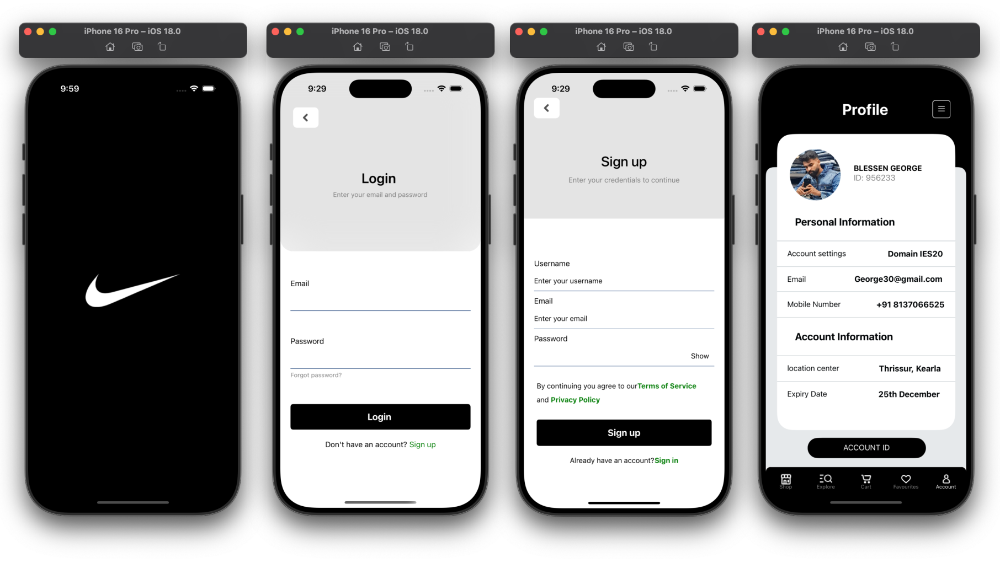
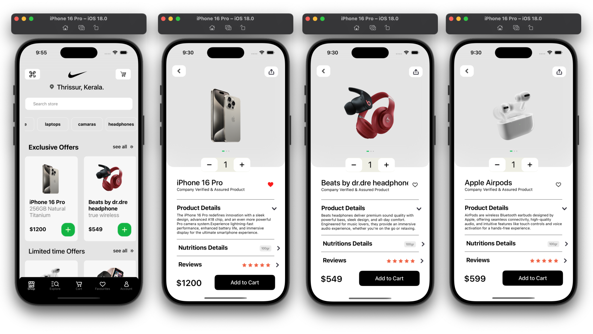
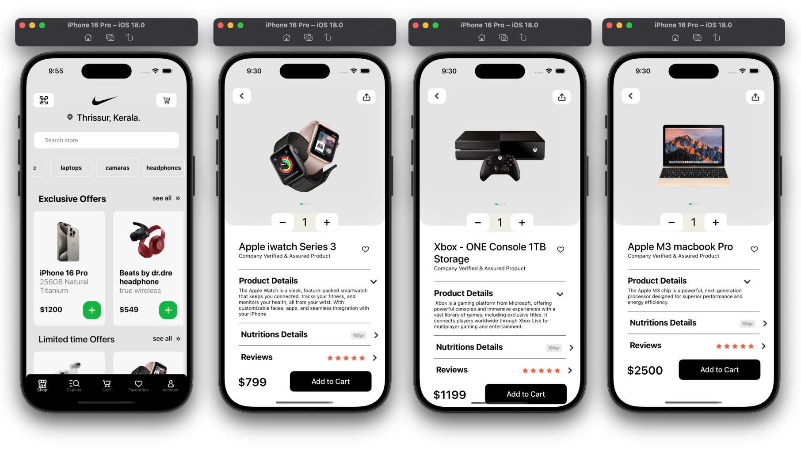
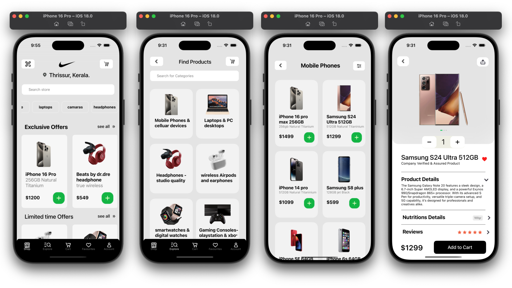

# E- Commerce Application   💻
Hey devs 👋 Check out the post creation flow of my E-Commerce Application 🔥

This is a React Native E-Commerce mobile application developed as part of my Assignment at ALT-D Technologies, Infopark. The app includes essential features for browsing and purchasing products online, with a focus on smooth user experience and modern design principles.

It’s packed with features that make online shopping seamless and user-friendly.
💡 Here’s a rundown of the features:

🛍️ Category Browsing: View product categories like laptops, cameras, and headphones.
📱 Responsive Design: Optimized for both iOS and Android with cross-platform compatibility.
🛒 Add to Cart: Simple product detail pages with easy add-to-cart functionality.
🧑‍💼 User Profiles: View and manage your user account.
💼 State Management: Efficient management of app-wide state for smooth navigation.
💸 Pricing and Offers: Exclusive offers with a clean display of prices and discounts.
🛒 Cart Management: Easily adjust product quantities or remove items from the cart.
📦 Product Details: Detailed product descriptions and specs.
⭐ Favorites: Save products to your favorites for quick access later.
🛠 Built with React Native for a fast, sleek shopping experience.

👉 Visit my GitHub for more details and check out the code: https://lnkd.in/gZwG2AGu

Feel free to check it out and let me know what you think!

 

##  Screenshots

## Features

- User Registration & Login: Secure user authentication with form validation.
- Category List & Detail Pages: Browse product categories and view detailed product listings
- Product List & Detail Pages: View all products within a category and explore their details, including pricing and specifications.
- Add to Cart: Users can add products to their cart with real-time updates.
- Cart Page: Review and manage items in the cart before proceeding to checkout.

feel free to see the working of the project : https://drive.google.com/file/d/1bw2aTm1tO_DpNXVdRt_FezgyVoaZFX4T/view?usp=drive_link

